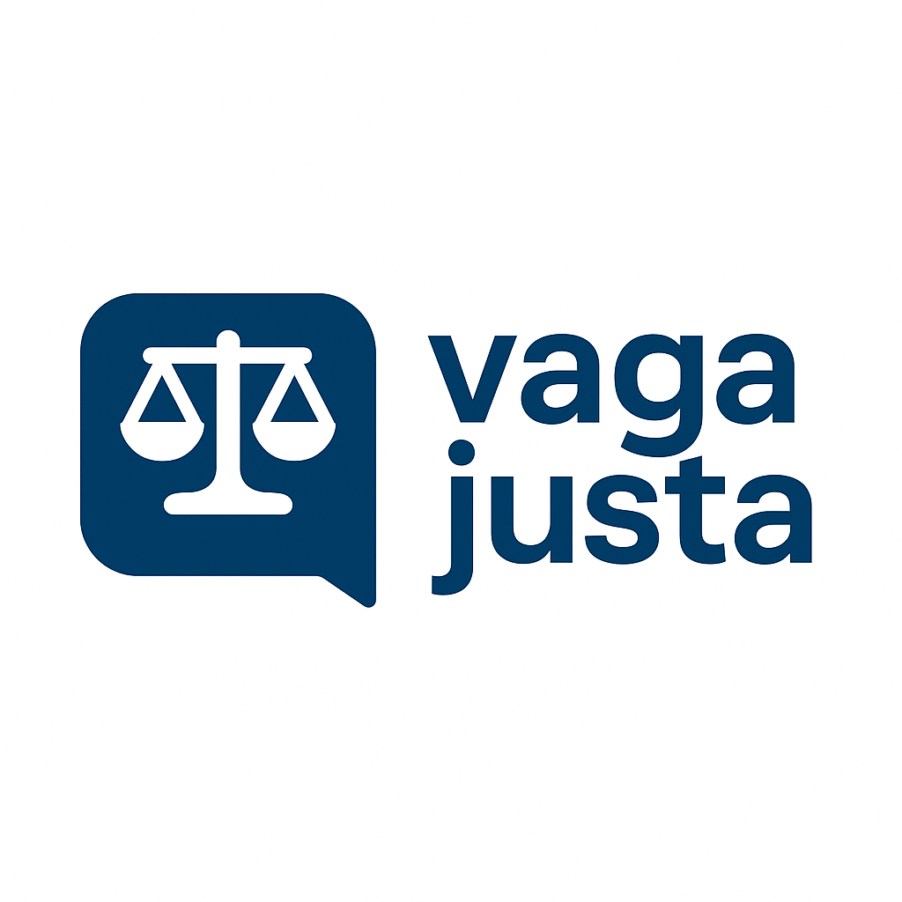

    

<h1 align="center" style="font-weight: bold;">Manifesto da Vaga Justa</h1>

Contratar é encontro, não labirinto.
Candidatos não são descartáveis.
Empresas não devem esconder o essencial.
Plataformas não podem servir apenas a um lado.

Este manifesto defende processos seletivos **claros, respeitosos e equilibrados**.

---

## Princípios

1. **Transparência acima de tudo**

    Nenhuma vaga deve existir sem salário, empresa, requisitos reais e etapas claramente definidas.
Vagas fantasmas não têm lugar aqui.

2. **Feedback é obrigação**

    O retorno ao candidato não é favor, é dever. Todo processo seletivo deve oferecer feedback claro, honesto e construtivo.

3. **Respeito ao tempo humano**

    Seleções intermináveis e inúteis não são aceitáveis. Cada etapa deve ter propósito real e duração proporcional à vaga.

4. **Avaliação justa**

    Testes técnicos devem medir habilidades práticas e relevantes, nunca armadilhas irreais ou provas maratonas que nada dizem.

5. **Reciprocidade**

    Contratação não é via de mão única. Candidatos e empresas têm direitos e deveres iguais no processo.

---

## Diretrizes

**Candidatos**

* Ser íntegro, honesto e comprometido.
* Respeitar prazos, etapas e comunicação.
* Valorizar empresas e plataformas que sigam práticas justas.

**Contratantes**

* Publicar apenas vagas reais, completas e transparentes.
* Oferecer feedback a todos os candidatos.
* Conduzir processos humanos, objetivos e respeitosos.

**Plataformas**

* Bloquear vagas incompletas, fantasmas ou enganosas.
* Garantir equilíbrio de poder entre candidatos e empresas.
* Usar tecnologia para simplificar e aproximar, não complicar.

---

## Compromissos

**Candidatos**

* Agir com integridade e apoiar práticas justas.
* Ser pró-ativo, disposto, sincero durante todo o processo.

**Empresas**

* Nunca publicar vagas sem salário ou requisitos claros.
* Reconhecer o valor do tempo e da dignidade do candidato.
* Revisar continuamente seus processos seletivos.

**Plataformas**

* Ser guardiãs da clareza e da equidade.
* Garantir voz e benefícios iguais para todos os lados.
* Promover inovação a serviço da justiça.

---

**Data de Criação:** 26/08/2025

**Versão:** 0.0.2

**Licença:** Creative Commons Attribution-ShareAlike 4.0 International License

---

_Este manifesto é um documento vivo e será atualizado conforme a evolução da comunidade e do mercado._